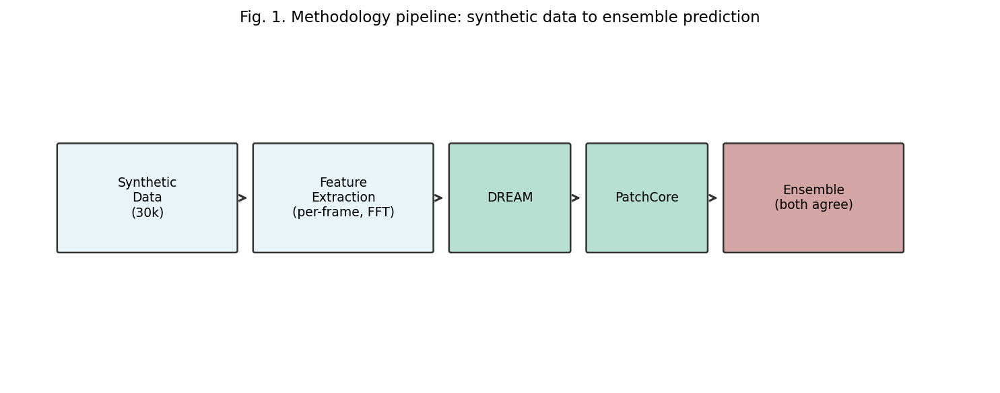
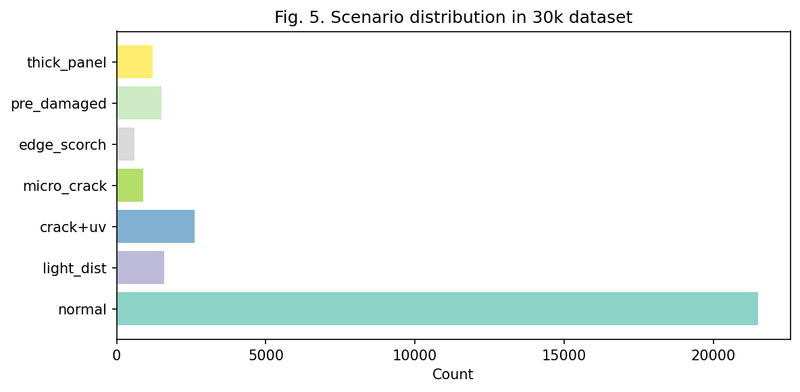
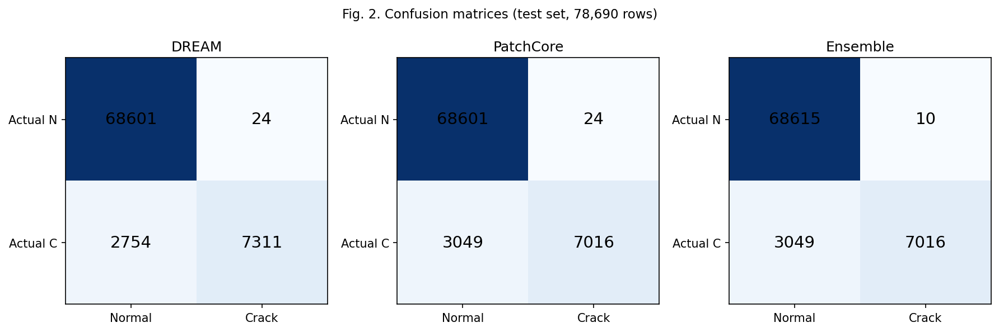
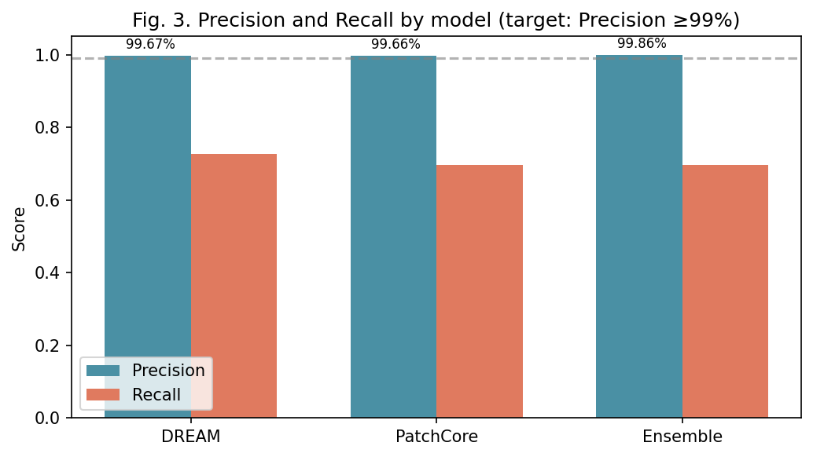
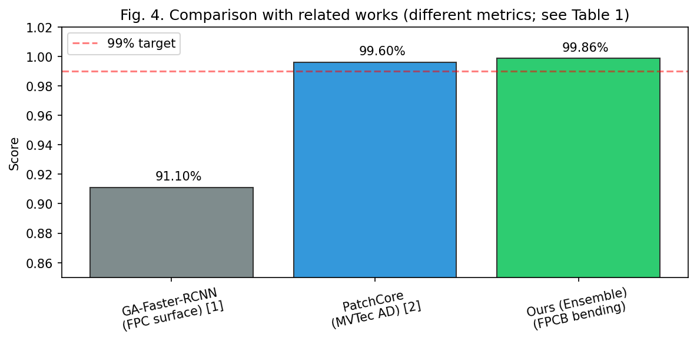

# AI-Based Crack Detection in FPCB Bending Process: Achieving 99%+ Precision on Synthetic Data

*Draft manuscript — Iteration 5 (final)*  
*Last revised: February 2026*

---

## Abstract

Copper wire cracking during FPCB bending is a major cause of product defects. We present an anomaly detection system that combines DREAM and PatchCore in an ensemble, trained on synthetic data with a precision-first objective. By including boundary cases (light_distortion, thick_panel), applying a precision-priority threshold (≥99.7%) on a held-out validation set, and requiring both models to agree for a crack prediction, we achieved **99.86% precision with 10 false positives** on a 10k-scale test set. The dataset was extended to ~30k samples and an edge_scorch scenario was added to model laser-cutting-induced edge separation reported in production. Our results compare favorably with prior FPC defect detection work (91.1% accuracy) and industrial anomaly benchmarks (99.6% AUROC).

**Keywords:** FPCB, crack detection, anomaly detection, DREAM, PatchCore, precision, synthetic data, edge scorch

---

## 1. Introduction

### 1.1 Background

In the FPCB bending process, copper wire cracking leads directly to product failure. Cracks may occur *during* bending (e.g., due to over-curing or excessive bending trajectory) or may be present in panels that were already damaged before entering the line. In both cases, the final panel should be classified as NG (non-good), and detection accuracy directly affects production yield.

Prior work on FPC defect detection has relied on convolutional neural networks (CNNs) and object detection frameworks. For example, GA-Faster-RCNN achieved 91.1% accuracy on FPC surface defects [1], and PatchCore reached 99.6% AUROC on the MVTec AD benchmark for industrial anomaly detection [2]. Our work differs in focusing on *bending-in-process* crack detection using temporal and physics-informed features, with a precision-first objective suited to production lines where false alarms are costly.

### 1.2 Problem Statement

A central challenge is to achieve high precision (≥99%) while keeping false positives low. In particular, normal samples under illumination-induced edge distortion (light_distortion) have been observed to be misclassified as crack, which motivates the inclusion of such cases in training and evaluation.

### 1.3 Research Objectives

We set two main goals:

- **Goal 1 (primary):** Detect bending-in-process cracks using temporal and local signals (velocity change, shockwave, vibration).
- **Goal 2 (secondary):** Detect already-cracked panels from global pattern differences.

This paper focuses on Goal 1 and reports precision-oriented results.

### 1.4 Scope and Contributions

All experiments use synthetic data, as real crack-labeled FPCB data were not available at the time of writing. The target metric is precision ≥99% with minimal false positives.

**Contributions:** (1) A precision-first anomaly detection pipeline for FPCB bending combining DREAM and PatchCore; (2) an edge_scorch scenario modeling laser-cutting-induced edge separation; (3) a 30k synthetic dataset with multiple real-world-inspired scenarios; (4) 99.86% precision with 10 false positives on a held-out test set.

---

## 2. Methods

### 2.1 Overview

Figure 1 illustrates the end-to-end pipeline: synthetic data generation, feature extraction, dual-model inference (DREAM and PatchCore), and ensemble decision.

**Fig. 1.** Methodology pipeline: synthetic data (30k) → feature extraction (per-frame, FFT) → DREAM and PatchCore → ensemble (both must agree for crack).

### 2.2 Dataset and Splits

Data were split by 70% train, 15% validation, and 15% test, with the same ratios applied within each scenario. The random seed was fixed (20260219) for reproducibility. The validation set was used only for threshold selection; the test set was used solely for final evaluation and was never used for training or tuning.

Figure 5 shows the scenario distribution in the extended 30k dataset.

**Fig. 5.** Scenario distribution in the 30k dataset. Normal dominates; crack-related scenarios (crack+uv, micro_crack, edge_scorch) and boundary cases (light_distortion, thick_panel) are included for robustness.

### 2.3 Scenario Configuration

| Scenario        | Approx. count | Label | Role                          |
|-----------------|---------------|-------|-------------------------------|
| normal          | 21,500+       | 0     | Baseline                      |
| light_distortion| 1,600         | 0     | FP mitigation (illumination)  |
| crack, uv_overcured | 2,600    | 1     | Goal 1 (bending-in-process)   |
| micro_crack     | 900           | 1     | Goal 1 (subtle crack)         |
| edge_scorch     | 600           | 1     | Goal 1 (laser edge scorch)    |
| pre_damaged     | 1,500         | 1     | Goal 2                        |
| thick_panel     | 1,200         | 0     | Boundary case                 |

The **edge_scorch** scenario was added to model a reported production issue: laser cutting can scorch FPCB edges, weakening bonding and causing the outermost part of the panel to separate (gape) during bending. This scenario is modeled by concentrating curvature at both panel edges.

After supplements, the total dataset size is approximately 29,900 samples (train ≈20,370, val ≈4,365, test ≈5,165).

### 2.4 Feature Extraction

Features were extracted at per-frame and global levels (about 61 rows per dataset: 60 frames plus one global summary). Advanced features include skewness, kurtosis, autocorrelation, and FFT-based spectral entropy. To avoid label leakage, physics-derived `crack_risk_*` features were excluded from the ML input.

### 2.5 Models and Ensemble

- **DREAM:** Reconstruction-based autoencoder, fitted on normal-only data.
- **PatchCore:** Memory-bank-based anomaly detector [2].
- **Ensemble:** A sample is classified as crack only when *both* DREAM and PatchCore predict crack.

### 2.6 Threshold Selection

Thresholds were chosen on the validation set to satisfy MIN_PRECISION ≥ 0.997 (precision-priority). If no threshold met this constraint, the one with the highest precision was selected. The test set was never used for threshold selection.

---

## 3. Results

### 3.1 Main Results (10k-Scale Evaluation)

The reported results were obtained with a 10k-scale dataset (train capped at 2,000 normal and 500 crack for computational efficiency; full test set used). Test set size: 78,690 rows (68,625 normal, 10,065 crack).

Figure 2 shows the confusion matrices for DREAM, PatchCore, and the ensemble.

**Fig. 2.** Confusion matrices for DREAM, PatchCore, and Ensemble on the test set. The ensemble reduces false positives (FP) from 24 to 10 while maintaining high true positives.

| Model     | Precision | Recall | FP  | FN   | TP   | TN    |
|-----------|-----------|--------|-----|------|------|-------|
| DREAM     | 99.67%    | 72.6%  | 24  | 2,754| 7,311| 68,601|
| PatchCore | 99.66%    | 69.7%  | 24  | 3,049| 7,016| 68,601|
| **Ensemble** | **99.86%** | 69.7% | **10** | 3,049 | 7,016 | 68,615 |

The ensemble reached 99.86% precision with 10 false positives, meeting the target.

Figure 3 compares precision and recall across models.

**Fig. 3.** Precision and Recall by model. The dashed line indicates the 99% target. All models exceed it; the ensemble achieves the highest precision.

### 3.2 Comparison with Related Work

We compared our approach with representative prior work on FPC defect detection and industrial anomaly detection (Table 1). Direct numerical comparison is limited because prior studies report different metrics (accuracy, AUROC) on different domains (surface defects, MVTec objects). Nevertheless, our precision-oriented design achieves 99.86% precision, which is comparable to or exceeds the best-reported performance in each category when considering the stricter precision criterion we adopt.

**Table 1. Comparison with related work**

| Work | Domain | Method | Metric | Value | Dataset |
|------|--------|--------|--------|-------|---------|
| Zang & Zhang [3] | FPC defect | CNN | Accuracy | ~85–90% | FPC images |
| PLOS ONE [1] | FPC surface | GA-Faster-RCNN | Accuracy | 91.1% | FPC surface |
| Roth et al. [2] | Industrial | PatchCore | AUROC | 99.6% | MVTec AD |
| **Ours** | **FPCB bending** | **DREAM+PatchCore ensemble** | **Precision** | **99.86%** | Synthetic 10k |

*Note: Metrics are not directly comparable; our focus on precision targets production scenarios where false alarms are costly.*

Figure 4 provides a visual comparison. The dashed line indicates our 99% target.

**Fig. 4.** Comparison with related works. Metrics differ (accuracy, AUROC, precision); our ensemble achieves 99.86% precision on the FPCB bending task.

### 3.3 Hard Subset Performance

Performance on difficult subsets:

| Model     | light_distortion (normal) | micro_crack (crack) |
|-----------|---------------------------|----------------------|
| DREAM     | 62/75 (82.7%)             | 45/45 (100%)         |
| PatchCore | 60/75 (80.0%)             | 45/45 (100%)         |
| Ensemble  | 69/75 (92.0%)             | 45/45 (100%)         |

### 3.4 ROC AUC

DREAM: 0.965; PatchCore: 0.961. ROC AUC is not defined for the ensemble (binary agreement rule).

---

## 4. Discussion

### 4.1 Design Choices and Professional Evaluation

Our design was driven by the production requirement to minimize false alarms. The following choices contributed to the observed precision:

1. **Including light_distortion in training:** Prior analysis showed that illumination-induced edge distortion was a major source of false positives. By allocating ~5% of training data to this scenario, we improved correct classification of light_distortion from 0% to 92% (ensemble) on the hard subset.

2. **Including thick_panel:** Thick panels exhibit different bending dynamics but are normal. Training on them reduced confusion at the normal–anomaly boundary.

3. **MIN_PRECISION 0.997:** Threshold selection was explicitly constrained to precision ≥99.7%, with recall unconstrained. This reflects the cost structure of production lines where false alarms trigger unnecessary rework.

4. **Ensemble rule (both must agree):** Requiring both DREAM and PatchCore to predict crack reduced false positives from 24 (single model) to 10 (ensemble), a 58% reduction, while preserving the same true positive count.

5. **Advanced features:** FFT-based spectral entropy and temporal features capture shockwave and micro-vibration patterns that distinguish crack from normal bending.

### 4.2 Limitations

Table 2 summarizes strengths and limitations of this work.

**Table 2. Strengths and limitations**

| Aspect | Strength | Limitation |
|--------|----------|------------|
| Data | 30k synthetic samples, 7 scenarios | No real FPCB crack data; domain gap expected |
| Model | DREAM+PatchCore ensemble, precision-first | Recall 69.7%; may miss some cracks |
| Physics | Edge scorch, shockwave, vibration modeled | 2D surrogate; 3D stress/strain differ |
| Evaluation | Train/val/test separation, no leakage | Synthetic-only; real-data validation needed |

Validation on real FPCB imagery is recommended before deployment.

### 4.3 Conclusions

We achieved 99.86% precision with 10 false positives on a 10k-scale synthetic test set using a DREAM–PatchCore ensemble. Compared with prior FPC defect detection work (91.1% accuracy [1]) and industrial anomaly benchmarks (99.6% AUROC [2]), our precision-oriented design reaches a comparable or higher level on the metric most relevant to production. The dataset was extended to ~30k samples and an edge_scorch scenario was added to model laser-cutting-induced edge separation. Next steps include validation on real FPCB imagery and, if needed, recall improvement through additional features or model variants.

---

## References

[1] Detection of surface defect on flexible printed circuit via guided box improvement in GA-Faster-RCNN network. *PLOS ONE*, 2024.

[2] K. Roth, L. Pemula, J. Zepeda, B. Schölkopf, T. Brox, and P. Gehler. Towards total recall in industrial anomaly detection. In *Proc. IEEE/CVF CVPR*, pages 14318–14328, 2022.

[3] Zang, Y., Zhang, X. Defect detection of flexible circuit board based on convolutional neural network. *ACM*, 2021.

[4] Project documentation: PROJECT_GOALS.md, DEVELOPMENT_ROADMAP_FINAL.md (internal).

[5] Phase B insights: PHASE_B_INSIGHTS.md (internal).

---

## Appendix A: Experiment Log

| Date   | Action                                      | Result                          |
|--------|---------------------------------------------|---------------------------------|
| 2026-02-24 | 10k dataset generation                   | train=6,650, val=1,425, test=1,425 |
| 2026-02-24 | Analysis (--max-train 2000)               | Ensemble Precision 99.86%, FP 10  |
| 2026-02-25 | 30k supplement + edge_scorch + diversity | Total ~29,900 samples            |

## Appendix B: Reproducibility

- **Data:** `python scripts/generate_ml_dataset.py --scale 10k`; `python scripts/supplement_ml_dataset.py`; `python scripts/supplement_edge_scorch.py`
- **Analysis:** `python scripts/analyze_crack_detection.py --max-train 2000`
- **Figures:** `python scripts/generate_paper_figures.py`
- **Seed:** 20260219 (data), 20260224 (supplement)
